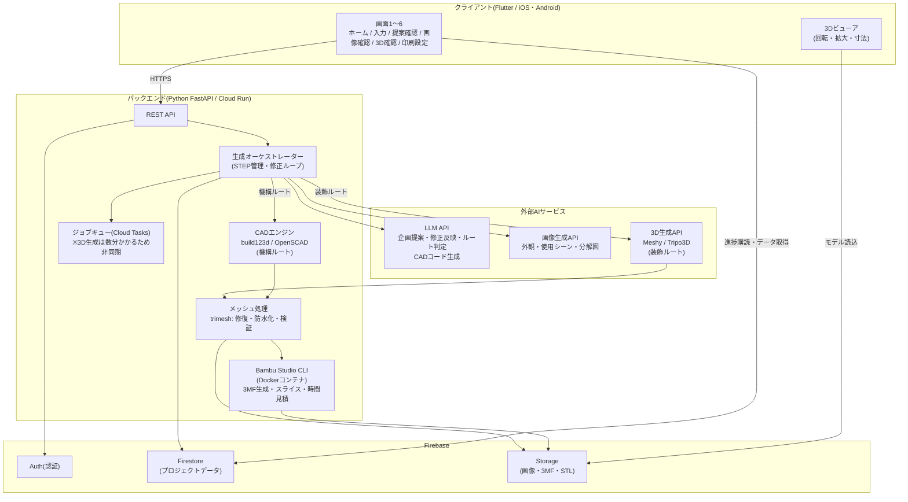
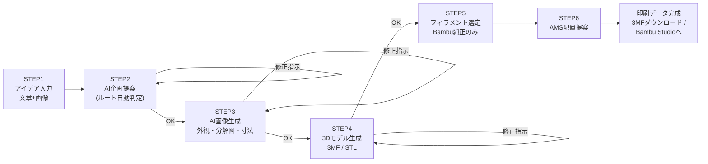
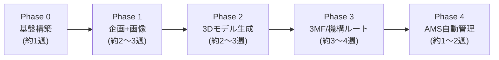

# AI 3D Product Designer — システム設計書(v0.1 承認待ち)

対象プリンター: Bambu Lab P2S(将来的にBambu Labシリーズ対応)
ステータス: **設計提案 — ユーザー承認後にPhase 1開発開始**

---

## 0. 設計の土台になる1つの重要な判断 — 「2ルート方式」

「作りたい物」には性質の異なる2種類があり、同じ生成方法では両方に精度が出ません。
そこで本アプリは内部で2つの生成ルートを持ち、AIが企画段階で自動判定します。

| | A: 装飾ルート | B: 機構ルート |
|---|---|---|
| 対象 | フィギュア・飾り・雑貨など「見た目もの」 | 名刺入れ・スタンド・ケースなど「寸法と機構が必要な物」 |
| 3D化の方法 | 画像 → AI 3D生成API(Meshy等) | LLMがパラメトリックCADコードを生成(検証済み機構テンプレート+寸法当てはめ) |
| 寸法精度 | 保証されない | mm単位で保証 |
| 例 | 「猫の置物を作って」 | 「名刺30枚・ボタン排出・ポケットサイズ」 |

ユーザーにはルートの違いを意識させず、STEP2の企画提案の中で自動的に振り分けます。

---

## 1. システム設計図

### 1-1. 全体アーキテクチャ



ポイント:

- **APIキーはすべてバックエンドのみが保持**。アプリには一切埋め込まない。
- 3D生成・スライスは数十秒〜数分かかるため**非同期ジョブ**とし、FlutterはFirestoreの進捗フィールドを購読して画面を更新する。
- Bambu Studio CLIをDockerコンテナでバックエンドに同梱し、**P2Sプロファイルでのスライス・印刷時間見積・3MF出力**をサーバー側で行う。

### 1-2. ユーザーフロー(STEP1〜6)と修正ループ



各STEPの「OK / 修正」はプロジェクトの状態機械(§4参照)として管理し、途中離脱しても続きから再開できます。

---

## 2. 必要API一覧

| # | 役割 | 採用候補 | 用途 | Phase | 課金形態 |
|---|------|---------|------|-------|---------|
| 1 | LLM(企画・対話) | OpenAI API(指示書指定)。機構ルートのCADコード生成にはClaude API(`claude-opus-5`)の併用を推奨(コード生成精度が高いため) | STEP2企画提案、修正反映、ルート判定、STEP5素材判断、CADコード生成 | 1 | 従量課金 |
| 2 | 画像生成API | OpenAI画像生成(gpt-image系)または Stable Diffusion系 | STEP3の外観・使用シーン・分解図・寸法イメージ | 1 | 従量課金 |
| 3 | 3D生成API | Meshy API または Tripo3D API(どちらか選定。両方対応可能な抽象化層を挟む) | STEP4装飾ルート(画像→3Dメッシュ) | 2 | クレジット制 |
| 4 | CADエンジン | build123d / OpenSCAD(OSS・無料。APIではなくバックエンド内蔵) | STEP4機構ルート(寸法保証の3Dモデル) | 3 | 無料 |
| 5 | メッシュ処理 | trimesh + manifold3d(OSS) | メッシュ修復・防水化・印刷可否検証 | 2 | 無料 |
| 6 | スライサ | Bambu Studio CLI(OSS) | 3MF生成、P2Sプロファイルでのスライス、印刷時間・フィラメント使用量見積 | 3 | 無料 |
| 7 | Firebase Auth | Firebase | ログイン(匿名認証→アカウント連携) | 1 | 無料枠あり |
| 8 | Firestore | Firebase | プロジェクトデータ・進捗のリアルタイム同期 | 1 | 従量課金 |
| 9 | Cloud Storage | Firebase | 入力画像・生成画像・STL/3MFの保存 | 1 | 従量課金 |
| 10 | FCM(通知) | Firebase | 「3Dモデルできたよ」のプッシュ通知 | 2 | 無料 |

補足:

- 3D生成APIのキー取得(Meshy/Tripo)はPhase 2開始時に必要。
- フィラメントデータ(Bambu純正の色・素材・耐熱性)はAPIが存在しないため、**アプリ内マスターデータ**として保持し、定期更新する(§4参照)。
- 具体的な単価は変動するため、Phase 1着手時に最新の各社料金ページで確認して見積もりを出します。

---

## 3. 開発ロードマップ



| Phase | 作るもの | 完了条件(これができたら次へ) |
|-------|---------|-------------------------------|
| **0 基盤** | モノレポ構成(`app/` Flutter+`server/` FastAPI)、Firebase プロジェクト、CI、認証 | Flutterアプリからバックエンドの疎通・ログインができる |
| **1 企画+画像** | 画面1〜4。STEP1入力(文章+画像添付)→STEP2企画提案→修正ループ→STEP3画像生成→修正ループ | 「名刺入れを作って」と入力すると企画書と画像が出て、修正指示が反映される |
| **2 3Dモデル生成** | 3D生成API連携(装飾ルート)、メッシュ修復、画面5の3Dビューア(回転・拡大)、非同期ジョブ+プッシュ通知 | 画像から3Dモデルが生成され、アプリ内で回して見られる。STL出力可能 |
| **3 3MF+機構ルート** | Bambu Studio CLI組込み(P2Sプロファイル)、3MF出力、印刷時間見積、機構テンプレート第1弾(箱・ケース・名刺入れ系)+LLM寸法当てはめ | 名刺入れ指示から「Bambu Studioで開いてそのまま印刷できる3MF」が出る |
| **4 AMS自動管理** | フィラメントマスターデータ、STEP5自動選定、STEP6 AMSスロット配置提案、画面6印刷設定 | スマホスタンド指示で「本体PETG黒+装飾PLAオレンジ、Slot1〜3配置案」まで自動提示される |

方針(指示書どおり):最初から完全版を作らず、各Phaseの完了条件を満たしてから次に進む。各Phase末にユーザーレビューを挟む。

---

## 4. データ構造設計

### 4-1. Firestore コレクション

```
users/{uid}
  displayName, createdAt, printerModel: "P2S", amsConnected: bool

projects/{projectId}                ← 1作品 = 1プロジェクト
  ownerUid
  title                             ← AIが命名(例:「スマートスライド名刺ケース」)
  status                            ← 状態機械(下記)
  route: "decorative" | "mechanism" ← STEP2でAIが判定
  createdAt, updatedAt

  idea:                             ← STEP1
    text: "名刺入れを作りたい。ボタンで取り出し..."
    imageRefs: ["gs://.../input1.jpg"]

  proposal:                         ← STEP2(修正のたびに revisions へ追記)
    productName: "スマートスライド名刺ケース"
    concept: "..."
    sizeMm: { w: 95, d: 65, h: 18 }
    capacity: "名刺30枚"
    mechanism: "ボタン式スライド排出"
    material: "Bambu PLA Basic"
    printTimeEstMin: 180
    features: ["窓付きフタ", "板バネ一体成形"]
    revisions: [ { userRequest: "もう少し薄く", appliedAt, diff } ]

  images:                           ← STEP3
    - { kind: "exterior" | "scene" | "exploded" | "internal" | "dimensions",
        url, prompt, approved: bool }

  model:                            ← STEP4
    format: "3mf" | "stl"
    url: "gs://.../model.3mf"
    polycount, watertight: bool, sizeMm
    genSource: "meshy" | "tripo" | "parametric"
    jobId, jobStatus: "queued" | "running" | "done" | "error"

  print:                            ← STEP5-6
    filaments:
      - { part: "本体", product: "Bambu PETG Basic", color: "Black", grams: 42 }
      - { part: "ボタン", product: "Bambu PLA Basic", color: "Orange", grams: 3 }
    ams: { slot1: "本体", slot2: "ロゴ", slot3: "ボタン" }
    printTimeMin: 195
    profile: "P2S_0.4nozzle_0.2mm"
    gcode3mfUrl: "gs://.../print.3mf"

filamentCatalog/{filamentId}        ← Bambu純正フィラメントのマスターデータ(運営が管理)
  product: "Bambu PETG Basic"
  colors: ["Black", "White", ...]
  properties: { strength: "high", heatResistC: 70, flexible: false }
  amsCompatible: true
```

### 4-2. プロジェクトの状態機械(status)

```
idea_input → proposing → proposal_review ⇄ (修正: proposing)
           → image_generating → image_review ⇄ (修正: image_generating)
           → model_generating → model_review ⇄ (修正: model_generating)
           → slicing → print_ready
           (各段階から error → 前状態へ復帰可能)
```

「OK/修正」ボタンはこの状態を進める・戻すだけのシンプルな操作に対応します。途中でアプリを閉じても`status`から再開できます。

### 4-3. バックエンドAPI(REST)

| メソッド | パス | 役割 |
|---------|------|------|
| POST | `/projects` | プロジェクト作成(STEP1入力) |
| POST | `/projects/{id}/proposal` | 企画生成(STEP2) |
| POST | `/projects/{id}/proposal/revise` | 修正指示の反映 |
| POST | `/projects/{id}/images` | 画像生成(STEP3)/ 修正は同エンドポイントに指示を渡す |
| POST | `/projects/{id}/model` | 3D生成ジョブ投入(STEP4・非同期) |
| POST | `/projects/{id}/slice` | スライス+3MF生成(STEP5-6) |
| GET | `/projects/{id}` | 状態取得(通常はFirestore購読で代替) |

---

## 5. リスクと対策(先に共有しておきたいこと)

1. **装飾ルートの品質ばらつき** — 画像→3Dは入力画像に大きく依存。STEP3で「単一オブジェクト・背景なし・斜め視点」に誘導するプロンプトを固定化して吸収する。
2. **機構ルートはテンプレート数が勝負** — Phase 3では「箱・ケース・名刺入れ系」から始め、以後テンプレートを追加していく拡張構造にする。
3. **APIコスト** — 1プロジェクトあたり画像数枚+3D生成1〜数回の従量課金が発生。Phase 1完了時に実測して1作品あたりの原価を出し、必要なら生成回数制限を設ける。
4. **Bambu Studio CLIのバージョン追従** — P2Sプロファイルの更新に合わせ、Dockerイメージを定期更新する運用を決めておく。

---

## 6. 承認のお願い

この設計で問題なければ「承認」と返信してください。Phase 0(基盤構築)から開発を開始します。
修正したい点(技術選定・画面・データ構造など)があればその旨を指示してください。設計書を更新します。
